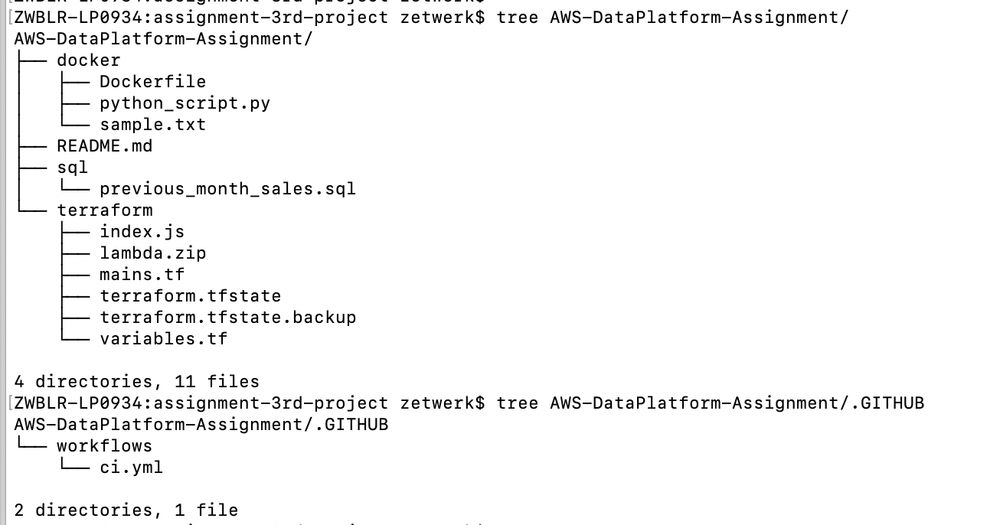

# assignment-terrafrom-cicd

# AWS Data Platform Assignment
==============================

## Project Overview
This project demonstrates a Continuous Integration pipeline for deploying infrastructure and uploading files to Amazon S3 using Terraform, Docker, Python (boto3), and GitHub Actions.

---

## Infrastructure Setup (Terraform)
- Provisions S3 bucket: `example-bucket-assignment`
- Deploys Lambda function: `lambda-assignment`
- Tracks source code checksum for re-deployment
- Configures Lambda environment variables

## Python Script (S3 Upload)
- Script uploads `sample.txt` to S3 using boto3
- Logs success/failure to console

## Dockerfile
- Builds Python 3.9 image with boto3 installed
- Runs the upload script

## CI/CD Pipeline (GitHub Actions)
- Trigger: On push to main
- Steps:
  - Builds Docker image
  - Runs container to test Python S3 upload

## SQL Query
- Generates product sales report for the previous month, ranked by total sales.

## Folder Structure
Refer to the repo layout for file placements.
AWS-DataPlatform-Assignment
## Architecture Diagram:


├── docker
│   ├── Dockerfile
│   ├── python_script.py
│   └── sample.txt
├── README.md
├── sql
│   └── previous_month_sales.sql
└── terraform
|    ├── index.js
|    ├── lambda.zip
|    ├── mains.tf
|    ├── terraform.tfstate
|    ├── terraform.tfstate.backup
|    └── variables.tf
.github/
└── workflows
    └── ci.yml


### Python S3 Upload Script
=============================
    File: docker/python_script.py

    Functionality:

        Uploads sample.txt to the provisioned S3 bucket.

        Logs success/failure messages.


### Dockerfile
===============
    Location: docker/Dockerfile

   Purpose:
  ----------
        Uses Python 3.9 base image.

        Installs boto3.

        Copies Python script & sample.txt.

        Executes upload on container run.

 ### CI/CD Pipeline (GitHub Actions)
==================================
    Workflow File: .github/workflows/ci.yml

    Pipeline Flow:

        Triggered on main branch push.

        Builds Docker image s3-uploader.

        Runs Docker container with AWS credentials.

        Executes Python script to upload file to S3.

Execution Steps
================
    Clone the repository:

git clone https://github.com/ChallaDevOps/AWS-DataPlatform-Assignment.git
cd AWS-DataPlatform-Assignment

## Terraform Deployment:

```
cd terraform
terraform init
terraform validate /  terraform fmt
terraform plan
terraform apply -auto-approve / terraform apply
```

# Secrets Setup:

    Add AWS_ACCESS_KEY_ID and AWS_SECRET_ACCESS_KEY in GitHub Secrets.

# Push Code to Trigger CI/CD Pipeline:
    ```
    git add .
    git commit -m "Final Submission"
    git push origin main
     ```
  Monitor GitHub Actions → Check Successful Deployment.

### Sample Output Logs
```
[INFO] Building Docker Image...
[INFO] Running S3 Upload Container...
INFO:root:File uploaded successfully to S3.
```
## Improvements

    Use Terraform remote backend (S3 & DynamoDB) for state management.
    Add unit tests for Python scripts.
    Integrate Terraform deployment in CI/CD pipeline.


## SQL 
=====

```
The query first calculates the total sales per product for the previous calendar month.

It filters data using sale_date to match previous month dates.

It aggregates sales using SUM(amount_sold) and groups by product_id.

Finally, it ranks products using the RANK() window function in descending order of total_sales.
```

---
